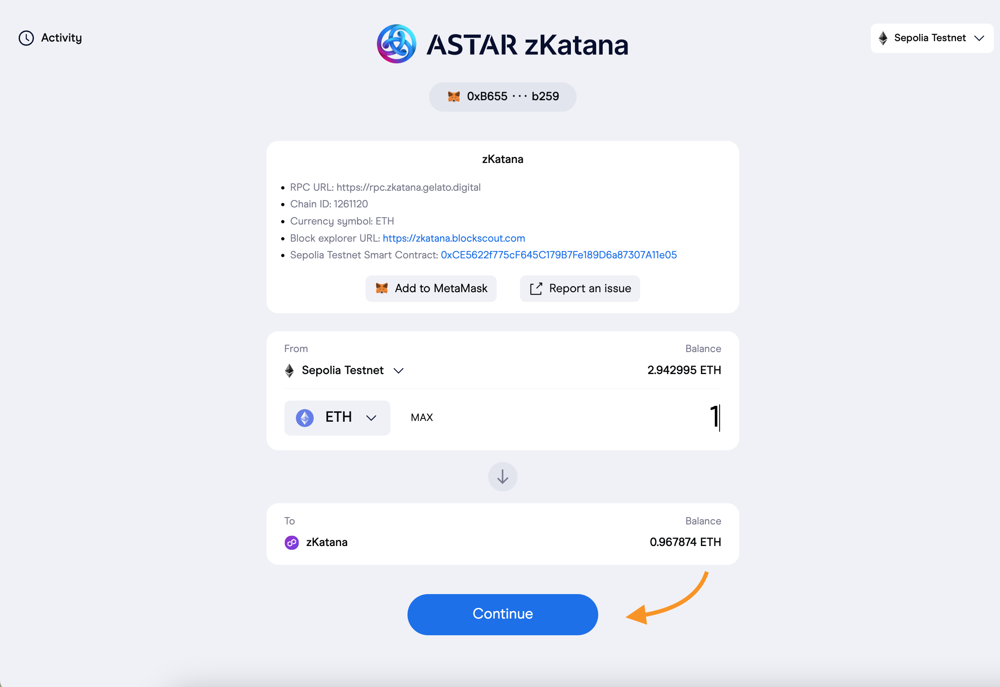

# ASTAR zKatana Starter-Kit

This starter helps to quick start developing on zKatana.
Please visit the public [website](https://raas.gelato.network/rollups/details/public/zkatana) and the [Block explorer](https://zkatana.blockscout.com/)

## Funding
You would need Sepolia test Eth. Please go to one of these faucets and grab some eth:

- [Alchemy Faucet](https://sepoliafaucet.com/)
- [Infura Faucet](https://www.infura.io/faucet/sepolia)
- [pow Faucet](https://sepolia-faucet.pk910.de/)

Once you have Sepolia Eth you will have to [bridge](https://bridge.zkatana.gelato.digital/) to zKatana eth. Please login in on Sepolia chain and brigde the required amount, it will take 8-10 minuts to confirm.



## Getting Started

1. Install project dependencies:
```
yarn install
```
in our package.json we have already included zkatana-gelato-protocol-kit
the 
2. Create a `.env` file with your private config:
```
cp .env.example .env
```
You will need to input your Private Key `PK` and `GELATO_RELAY_API_KEY` for sponsored transactions, you an get it at [https://relay.gelato.network](https://relay.gelato.network)


## Account Abstraction (AA)

As part of the Gelato Raas AA offerings, we have deployed a custom safe-sdk creating following packages

| Package| SDK |
| --- | ----------- |
| Safe Protocol Kit | zkatana-gelato-protocol-kit|
| Safe AA Kit | zkatana-gelato-account-abstraction-kit|
| Safe Relay Kit | zkatana-gelato-relay-kit|

In the [Raas AA UI starter Kit](https://github.com/gelatodigital/gelato-raas-aa-ui-starter) we showcase how to implement AA with web3Auth for social login, Safe as smart contract wallet and Gelato Relay for Gasless transactions.
A live demo on zKatana can be seen here:
 [https://raas-ui-starter.web.app/](https://raas-ui-starter.web.app/)
 
Here we are going to show the two different ways to send Gasless Transactions through a Safe, either sponsoring the gas with [1Balance](https://docs.gelato.network/developer-services/1balance) or paying with the Safe balance (SyncFee) 

In both examples we are going to `increment()`the counter on this simple contract deployed on zKatana [https://zkatana.blockscout.com/address/0x47A9064a8D242860ABb43FC8340B3680487CC088?tab=read_contract](https://zkatana.blockscout.com/address/0x47A9064a8D242860ABb43FC8340B3680487CC088?tab=read_contract)

### Using 1Balance

```typescript
const safeAccountAbstraction = new AccountAbstraction(signer);
  const sdkConfig: AccountAbstractionConfig = {
    relayPack,
  };
  await safeAccountAbstraction.init(sdkConfig);

  // Create a transaction object
  const txConfig = {
    TO: targetAddress,
    DATA:counterContract.interface.encodeFunctionData("increment", []),
    // Options:
    GAS_LIMIT: gasLimit,
    VALUE:"0"
  };

  const predictedSafeAddress = await safeAccountAbstraction.getSafeAddress();
  console.log({ predictedSafeAddress });

  const isSafeDeployed = await safeAccountAbstraction.isSafeDeployed();
  console.log({ isSafeDeployed });

  const safeTransactions: MetaTransactionData[] = [
    {
      to: txConfig.TO,
      data: txConfig.DATA,
      value: txConfig.VALUE,
      operation: OperationType.Call,
    },
  ];
  const options: MetaTransactionOptions = {
    gasLimit: txConfig.GAS_LIMIT,
    isSponsored: true,
  };

  const response = await safeAccountAbstraction.relayTransaction(
    safeTransactions,
    options
  );
  console.log(`https://relay.gelato.digital/tasks/status/${response} `);
```
**Output**
```shell
$ ts-node src/aa-safe-gasless/aa1Balance.ts
{ predictedSafeAddress: '0x68D60c586763879c6614e2eFA709cCae708203c4' }
{ isSafeDeployed: true }
https://relay.gelato.digital/tasks/status/0xc34f62e1b057b298c144c79b3cc16e4e24bc2b1e91ce5cd7660f9b8c1791be91 
```

### Using  SyncFee  
Remember to fund your Safe as the gas fees will be deducted from your safe balance

```typescript

  const gasLimit = "10000000";
  
  const safeAccountAbstraction = new AccountAbstraction(signer);
  const sdkConfig: AccountAbstractionConfig = {
    relayPack,
  };
  await safeAccountAbstraction.init(sdkConfig);

  const txConfig = {
    TO: targetAddress,
    DATA: counterContract.interface.encodeFunctionData("increment", []),,
    VALUE: "0",
    // Options:
    GAS_LIMIT: gasLimit,
    GAS_TOKEN: ethers.constants.AddressZero,
  };

  const predictedSafeAddress = await safeAccountAbstraction.getSafeAddress();
  console.log({ predictedSafeAddress });

  const isSafeDeployed = await safeAccountAbstraction.isSafeDeployed();
  console.log({ isSafeDeployed });

  const safeTransactions: MetaTransactionData[] = [
    {
      to: txConfig.TO,
      data: txConfig.DATA,
      value: txConfig.VALUE,
      operation: OperationType.Call,
    },
  ];
  const options: MetaTransactionOptions = {
    gasLimit: txConfig.GAS_LIMIT,
    gasToken: txConfig.GAS_TOKEN,
    isSponsored: false,
  };

  const response = await safeAccountAbstraction.relayTransaction(
    safeTransactions,
    options
  );
  console.log(`https://relay.gelato.digital/tasks/status/${response} `);
```

  **Output**
  ```shell
 $ ts-node src/aa-safe-gasless/aaSyncFee.ts
{ predictedSafeAddress: '0x68D60c586763879c6614e2eFA709cCae708203c4' }
{ isSafeDeployed: true }
https://relay.gelato.digital/tasks/status/0x6590f89386d9adb8a6d20ba7dffaa17958d4e66d49e6a0d3b5b1c144022abbc1 
  ```

## Working with Safes

We have deployed and verified the the Safe contracts and also we forked the safe sdk to be able to test in ASTAR zKatana. 
The forked safe-sdk is published under the package  **zkatana-gelato-protocol-kit@1.3.1**. The relay-kit and account.abstraction-kit will be published very soon.


### Create a Safe
Code can be seen [here](./src/safe/create-safe.ts#L19) 

```shell
yarn create-safe
```

```shell
yarn run v1.22.19
$ ts-node src/create-safe.ts
Network:  { chainId: 1261120, name: 'unknown' }
Safe created with address:  0x881C6d3319a825643dCf95437FcD34BD67481d8e
✨  Done in 13.27s.
```

### Increment counter
We have deployed a [SimpleCounter](https://zkatana.blockscout.com/address/0x47A9064a8D242860ABb43FC8340B3680487CC088) contract  where we are going to increment the counter through a safe transaciton.
Here the [code](./src/safe/increment-counter.ts#L35) 

```shell
yarn increment-counter
```

```shell
$ ts-node src/increment-counter.ts
TxHash:  0xce9271aba30a6e68a36f3ce75690ea63e2258d7d9a1d2bb69d58b10ae4fd70d7
✨  Done in 15.47s.
```

## Verify Contracts with api
We have deployed the contract [SimpleCounterUser](./contracts/SimpleCounterUser.sol) at [https://zkatana.blockscout.com/address/0x00D76203b92ec96bB46d252e3A30660D6a9bD319](https://zkatana.blockscout.com/address/0x00D76203b92ec96bB46d252e3A30660D6a9bD319) and verified using axios post api call following the script [verify-api](./src/utils/verify-api.ts).

```typescript
async function verify() {
  let contractaddress = "0x00D76203b92ec96bB46d252e3A30660D6a9bD319";
  axios
    .post("https://zkatana.blockscout.com/api?module=contract&action=verify", {
      addressHash: contractaddress,
      compilerVersion: "v0.8.18+commit.87f61d96",
      contractSourceCode: `// SPDX-License-Identifier: MIT
      pragma solidity 0.8.18;
      
      contract SimpleCounterUser {
          uint256 public counter;
          mapping(address=> uint) public incrementsByUser;
          event IncrementCounter(uint256 newCounterValue, address msgSender);
      
          function increment() external {
              counter++;
              incrementsByUser[msg.sender]++;
              emit IncrementCounter(counter, msg.sender);
          }
      }`,
      name: "SimpleCounterUser",
      optimization: true,
      runs:200

    })
    .then((response) => console.log(response.data))
    .catch((err) => console.log(err));
}
verify();
```
The contract was verified successfully

## 実際に動かした記録


### 参考文献
1. [Gelato relay dashboard](https://app.gelato.network/relay)